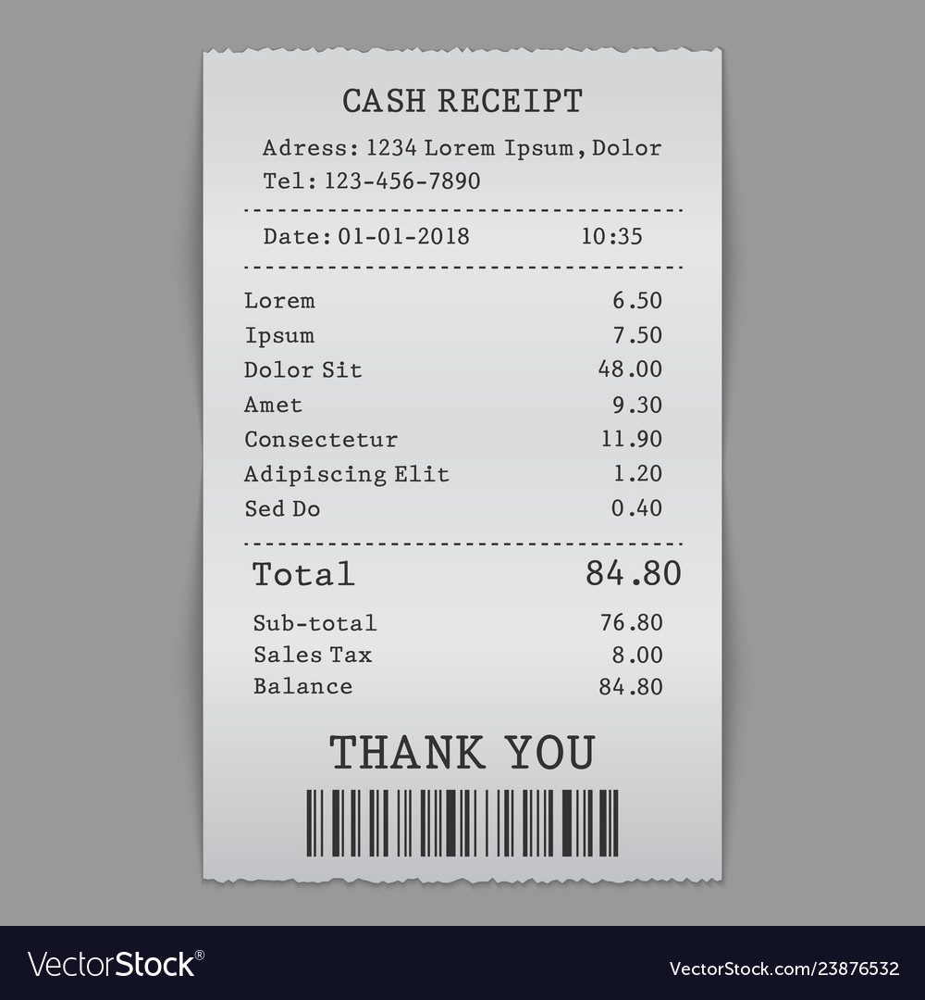

# How to Build a Kick-Ass Mobile Document Scanner in Just 5 Minutes

OpenCV를 이용하여 Document Scanner를 Build하기 위해서 세 가지 Step만 따르면 된다.
- **Step 1**: Detect edges.
- **Step 2**: Use the edges in the image to find the contour (outline) representing the piece of paper being scanned.
- **Step 3**: Apply a perspective transform to obtain the top-down view of the document.

이 세가지 Step만 거치면 문서 스캔 앱을 App Store에 등록할 수 있다.

**OpenCV and Python version:**
This example will run on **Python 2.7/3+** and **OpenCV 2.4/3+**

`python scan.py -i images/example_01.jpg`

## Step 1: Edge Detection

```python
# load the image and compute the ratio of the old height
# to the new height, clone it, and resize it
image = cv2.imread(args["image"])
ratio = image.shape[0] / 500.0
orig = image.copy()
image = imutils.resize(image, height = 500)
# convert the image to grayscale, blur it, and find edges
# in the image
gray = cv2.cvtColor(image, cv2.COLOR_BGR2GRAY)
gray = cv2.GaussianBlur(gray, (5, 5), 0)
edged = cv2.Canny(gray, 75, 200)
# show the original image and the edge detected image
print("STEP 1: Edge Detection")
cv2.imshow("Image", image)
cv2.imshow("Edged", edged)
cv2.waitKey(0)
cv2.destroyAllWindows()
```

- 이미지 로드:  
`image = cv2.imread(args["image"])`
- 이미지 처리 속도를 높이고, edge detection을 보다 정확하게 만들기 위해 높이가 500pixel이 되도록 조정한다:  
`ratio = image.shape[0] / 500.0`
- 이미지의 원래 height, 그리고 new height을 구분하기 위해 원본을 저장:
  - resized image가 아닌 원본 이미지로 스캔을 수행할 수 있다.  
`orig = image.copy()`
- 이미지를 gray scale로 변환하고, Gaussian blurring을 진행하여 noise를 제거하고, Canny edge detection을 수행한다.  
`gray = cv2.cvtColor(image, cv2.COLOR_BGR2GRAY)`  
`gray = cv2.GaussianBlur(gray, (5, 5), 0)`  
`edged = cv2.Canny(gray, 75, 200)`  




## Step 2: Finding Contours (윤곽선 찾기)

Document Scanner를 만든다고 할 때, 큰 이점이 있다.  
Document Scanner는 단순히 종이를 스캔하고, 종이는 직사각형이라고 가정한다.  
그리고 직사각형에는 네 개의 모서리가 있다.  
따라서 문서 스캐너를 만드는 데 도움이 되는 간단한 heuristic을 만들 수 있다.
- 정확히 4개의 점이 있는 이미지에서 가장 큰 윤곽선이 스캔할 종이라고 가정한다.
- 이것은 합리적인 가정이며, 스캐너 앱은 단순히 스캔하려는 문서가 이미지의 주요 초점이라고 가정한다.
- 또한, 종이에 4개의 가장자리가 있다고 가정하는 것이 안전하다. (적어도 그래야한다)

```python
# find the contours in the edged image, keeping only the
# largest ones, and initialize the screen contour
cnts = cv2.findContours(edged.copy(), cv2.RETR_LIST, cv2.CHAIN_APPROX_SIMPLE)
cnts = imutils.grab_contours(cnts)  
cnts = sorted(cnts, key = cv2.contourArea, reverse = True)[:5]  

# opencv의 fineContours 라이브러리를 이용하여 가장자리의 edge를 찾는다. 
# 구한 contours들을 정렬하고, 가장 큰 윤곽선만 유지한다.
# for loop: 해당 contour들의 point를 대략적으로 계산한다.

# loop over the contours  
for c in cnts:  
	# approximate the contour  
	peri = cv2.arcLength(c, True)  
	approx = cv2.approxPolyDP(c, 0.02 * peri, True)  
	# if our approximated contour has four points, then we  
	# can assume that we have found our screen  
	if len(approx) == 4:  
		screenCnt = approx  
		break
# show the contour (outline) of the piece of paper  
print("STEP 2: Find contours of paper")  
cv2.drawContours(image, [screenCnt], -1, (0, 255, 0), 2)
cv2.imshow("Outline", image)
cv2.waitKey(0)
cv2.destroyAllWindows()
```

4개의 Point를 찾아냈으므로, `drawContours`로 해당 포인트들을 잇는다.


## Step 3: Apply a Perspective Transform & Threshold (원근 변환 및 Threshold 적용)

모바일 문서 스캐너를 만드는 마지막 단계는 문서의 윤곽을 나타내는 4 개의 점을 가져와 perspective transform을 적용하여 이미지의 top-down image, 즉 '조감도'를 얻는 것이다.  

```python
# apply the four point transform to obtain a top-down
# view of the original image
warped = four_point_transform(orig, screenCnt.reshape(4, 2) * ratio)
# convert the warped image to grayscale, then threshold it
# to give it that 'black and white' paper effect
warped = cv2.cvtColor(warped, cv2.COLOR_BGR2GRAY)
T = threshold_local(warped, 11, offset = 10, method = "gaussian")
warped = (warped > T).astype("uint8") * 255
# show the original and scanned images
print("STEP 3: Apply perspective transform")
cv2.imshow("Original", imutils.resize(orig, height = 650))
cv2.imshow("Scanned", imutils.resize(warped, height = 650))
cv2.waitKey(0)
```

- wraping transform 수행: four_point_transform 함수에 의해 처리된다.
- 두 개의 인수를 four_point_transform에 전달한다.
  - 원본 이미지
  - document를 나타내는 윤곽선에 resized ratio를 곱한 것
`warped = four_point_transform(orig, screenCnt.reshape(4, 2) * ratio)`  

***왜 resized ratio를 곱하는 걸까?***  
edge detection을 수행하고, height=500 pixel에서 윤곽선(contours)을 찾았으므로, resized ratio를 곱한다.  
그러나, resized image가 아닌 original image에 대해서 스캔을 수행하려고 하므로, 윤곽선 포인트(contour points)에 크기조정 비율(resized ratio)을 곱한다.  

이미지에 흑백 느낌을 위해 warped image를 가져와 gray scale로 변환하고, adaptive threshold를 적용한다.


